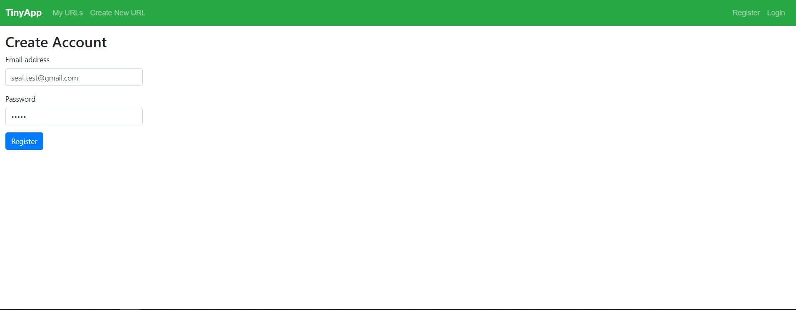
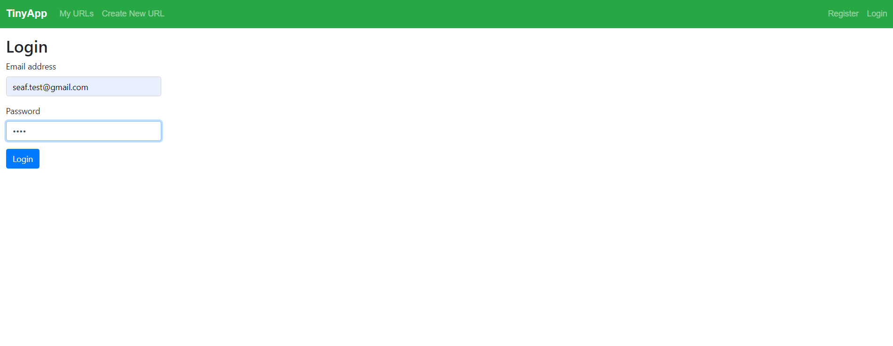
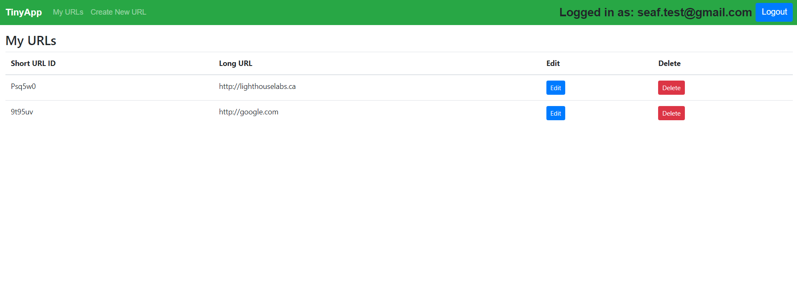
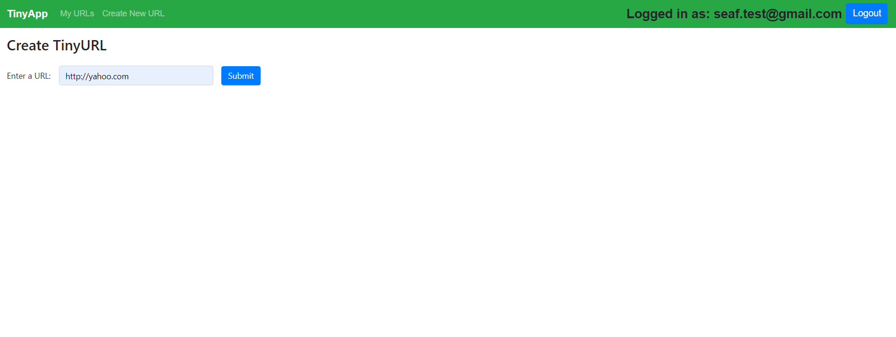
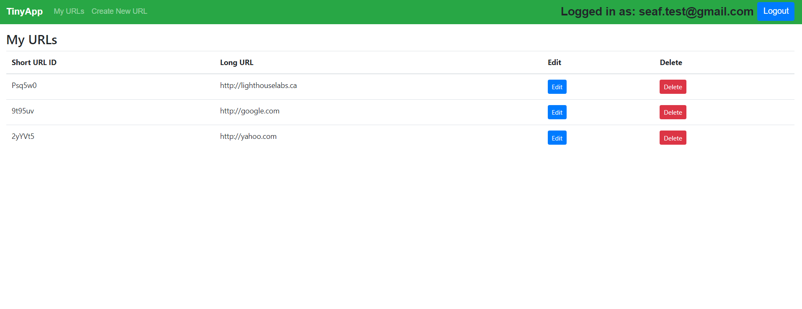
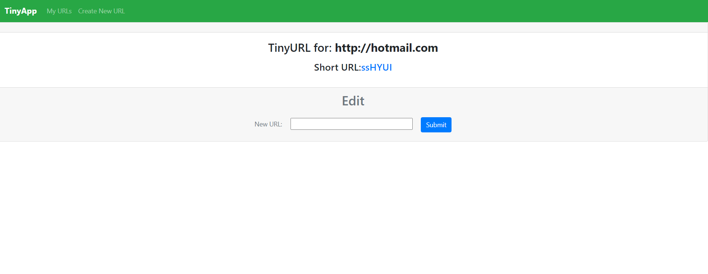

# TinyApp Project

TinyApp is a full stack web application built with Node and Express that allows users to add shorten long URLs .
and edit , detete URLs. redirect to original URL.

This project utilizes specific technologies such as:

- Web Server: Node.js
- Middleware: Express
- Template Engine: EJS

# Project Views:
The following are the final project views:

## Register Page:

## Login Page:

## Main Page:

## Create New URL Page:

## URL List Page:

## Edit URLs Page:

## Dependencies:

- Node.js
- Express
- EJS
- Bcrypt
- Bcryptjs
- Bootstrap
- Cookie-Session
- Cookie-parser

## Getting Started:

Install all dependencies using the npm install command.
Run the web server using the npm start command.
To register, go to: http://localhost:8080/register.
To log in, go to: http://localhost:8080/login.
Use the nagivation bar to:
Create new shorten URLs
View list of URLs ( You mustto login first)
Edit and Delete buttons to update your URLs in Your URLs